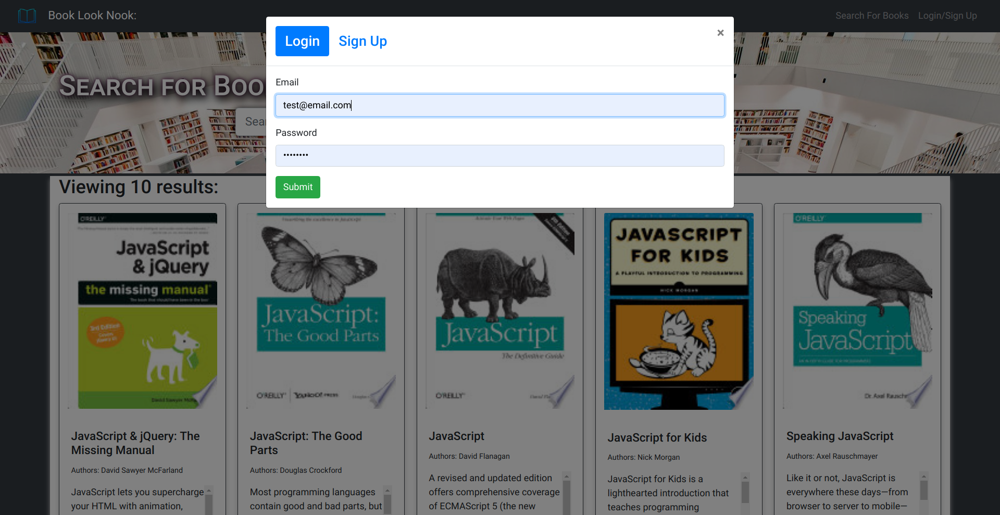
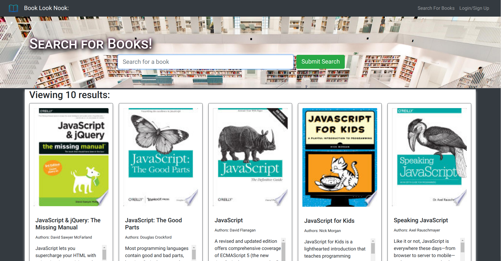
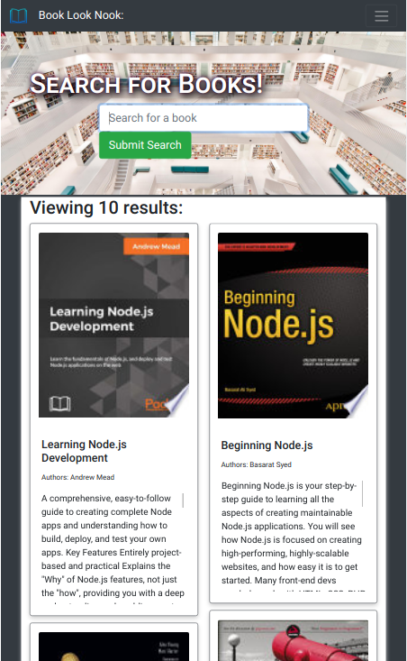

<div align="center">
<h1>
</img>
  Book-Look-Nook  </img></h1>
<p align="center">


</p>
<hr>
</div>


<p align="center"></p>

<p>Well it started as a fully functioning Google Books API search engine built with a RESTful API. . . </p>
<p>However; after I have performed some good ol' refactorin' and have made it into a much prettier application it is now a fully functioning Google Books API search engine built with a GraphQL API built with Apollo Server. </p><p>The app was built using the MERN stack with a React front end MongoDB database and Node.js/Express.js server and API. It's all set up to allow users to save book searches to the back end. 
<p>Enjoy!</p>

<h2>Project Screenshots:</h2>
<div align="center">
<a href="./images/BLN_Login.png">

</a>
<a href="./images/BLN_search.png">

</a>
<a href="./images/BLN_search_mobile.png">

</a>
</div>
<h2>🛠️ Installation Steps:</h2>

<p>1. Clone this Repo</p>

```
git clone git@github.com:Proto133/MERN-BookSearch.git
```

<p>2. Navigate to Project Root</p>

<p>3. Install Dependencies</p>

```
npm run install
```

<p>4. Install concurrently (if not done through previous step)</p>

```
npm i concurrently
```

<p>5. Start Server and Frontend</p>

```
npm run develop
```

<p>6. Optionally You Can Just Use the Deployed Application:</p>

[Book Look Nook: Your Place to Search for Books](https://book-look-nook.herokuapp.com/)

<h2>🍰 Contribution Guidelines:</h2>

Contribute freely. . . or don't. It's pretty much going to do all it was ever going to do.

<h2>🛡️ License:</h2>

This project is licensed under the MIT License

<h2>💖Like my work?</h2>

If you would like me to make something for you, you want to hire me, or you happen to need any support using this application-- please, [email me: support@peterroto.com](mailto:support@peterroto.com)